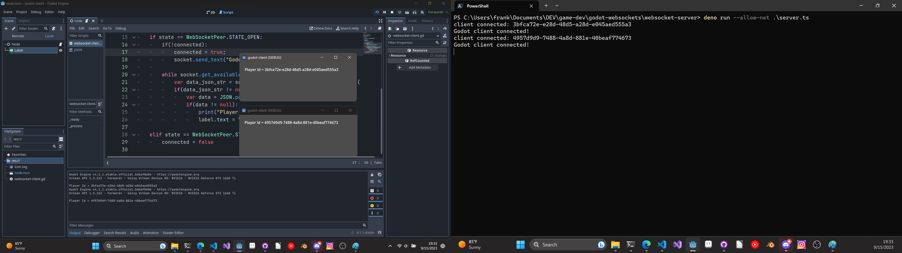

# godot-websockets

A simple websocket example using Godot (client) and Deno (server). Doesn't
really do much but demonstrate how to connect to a websocket server and
send/receive messages from a Godot game.

## screenshot

## Author(s)

Frank Hale &lt;frankhaledevelops @ gmail.com&gt;

## Date

27 October 2024
